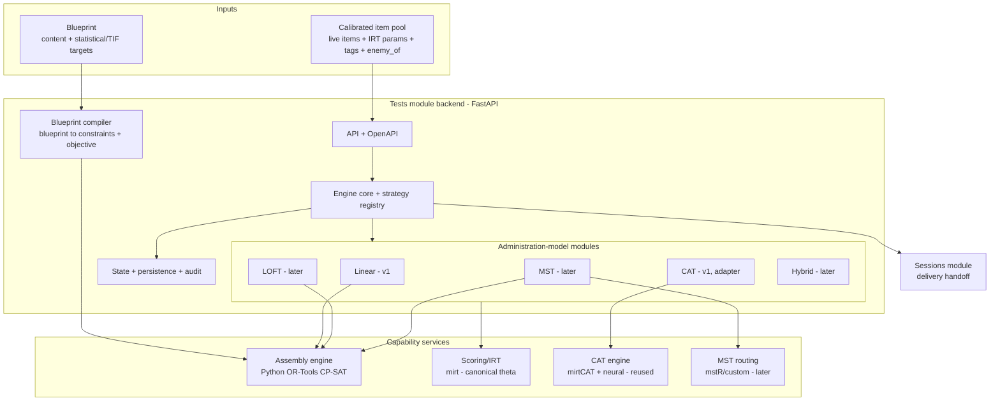

# Tests Module — Architecture & Build Plan (v1.0)

> Production-worthy assembly + administration engine for a large-scale testing program.
> Scope of this document: the **Tests module** — from a calibrated item bank (input) to the Sessions module (exit).

---

## 0. How to read this

This is the canonical reference for the build. It encodes every architectural decision reached
during planning, with enough concrete detail (interfaces, schemas, repo layout, phases) for Claude
Code to execute it in Positron. Where a contract depends on an existing repo (item-factory export,
CAT platform endpoints), it is marked **[pin against repo]** — confirm the exact fields before coding
that seam.

---

## 1. Goal, scope, principles

**Goal.** A Tests module that lets a test developer define a blueprint, assemble forms/pools, and
configure the critical specifications (item-selection algorithm, stopping rule, exposure control,
routing) for a *range* of administration models — and hand the result to the Sessions module for
delivery.

**Administration models.**
- **v1 (build now):** Linear fixed-form; CAT (port of the existing CAT platform).
- **Fast-follow:** LOFT; MST; hybrids (e.g., LOFT-MST, on-the-fly MST).

**Principles (locked in).**
1. **Modular per administration model on a shared spine.** Each model is a self-contained module that
   plugs into one common interface (`AdministrationStrategy`) via a registry. Adding a model = writing
   a new module + registering it. No edits to the spine or to sibling modules. This is the
   non-disruptive extensibility requirement, enforced structurally.
2. **Capability-oriented engine services**, not one-package-per-model. Distinct capabilities
   (assembly, CAT, scoring/θ, MST routing) sit behind interfaces; implementations are swappable.
3. **Single source of truth for the θ metric.** One canonical IRT parameterization and scoring
   service; every engine that touches θ is normalized to it.
4. **Contract-first.** Backend defines OpenAPI; the frontend client (Orval + Zod) is generated from it.
5. **Containerize from day one** so local → EC2 → managed AWS is a deployment change, not a rewrite.
6. **Reuse, don't fork.** Preserve all CAT functionality by reusing the existing CAT engine services;
   keep a single source of truth for CAT logic.

---

## 2. Stack (reused from the CAT prototype)

| Layer | Choice |
|---|---|
| Backend | Python 3.12, FastAPI, Pydantic v2, SQLAlchemy 2, Alembic |
| Async / jobs | Redis + RQ (assembly jobs, batch form generation) |
| DB | PostgreSQL |
| Assembly engine | **Python + OR-Tools (CP-SAT)** — owned in-house |
| CAT engine | **Existing CAT platform** (mirtCAT R service + neural service), reused via adapter |
| Scoring / IRT | `mirt` (R) behind a thin scoring service = canonical θ metric |
| MST routing (fast-follow) | `mstR` or thin custom routing on the canonical metric |
| Assembly validation oracles | `TestDesign`, `eatATA` (R) — dev-time parity checks only, not a runtime dependency |
| Frontend | React + TypeScript + Vite + Tailwind + **Orval** (typed client) + Zod |
| Delivery / proxy | nginx |
| Orchestration | docker-compose (dev/staging); managed AWS later |
| Dev tooling | conda env, Positron, Claude Code |

---

## 3. System architecture



**Reading the diagram.**
- **Blueprint** is shared and consumed by every model. The **assembly engine (ATA)** is a shared
  capability used by the *form/pool/panel* models (Linear, LOFT, MST). **CAT does not use ATA** — it
  uses runtime selection via the reused CAT engine (shadow-test ATA is an optional later upgrade).
- The **engine core** is model-agnostic: it routes a session through whichever module the config
  names, and hands off to **Sessions** at the end.

---

## 4. The administration-model contract

Every model implements one interface. The engine never branches on model type.

```python
# backend/app/engine/contract.py
from abc import ABC, abstractmethod
from typing import Literal
from pydantic import BaseModel

class NextAction(BaseModel):
    kind: Literal["present", "complete"]
    payload: dict          # items/module to present, or final disposition
    navigation: "Navigation"

class Navigation(BaseModel):
    can_review: bool
    can_skip: bool
    can_navigate_back: bool
    fixed_length: bool
    total_items: int | None  # None when adaptive/unknown

class TerminationDecision(BaseModel):
    complete: bool
    reason: str | None       # max_items, min_sem, sprt, end_of_form, ...

class AdministrationStrategy(ABC):
    """One per administration model. Pure-ish: state in, state/action out."""

    model_type: str          # "linear", "cat", "loft", "mst", ...
    config_schema: type[BaseModel]  # the per-model config branch

    @abstractmethod
    def initialize(self, config, pool_ref, context) -> "SessionState":
        """Linear/LOFT/MST: assemble or load the form/panel here.
        CAT: initialize theta, pick first item (neural cold-start)."""

    @abstractmethod
    def next_action(self, state) -> NextAction: ...

    @abstractmethod
    def record_response(self, state, response) -> "SessionState":
        """CAT: update theta. Linear: advance position."""

    @abstractmethod
    def is_complete(self, state) -> TerminationDecision: ...

    @abstractmethod
    def score(self, state) -> "ScoreResult":
        """Delegates to the scoring capability for the canonical metric."""

    @abstractmethod
    def capabilities(self) -> Navigation: ...
```

```python
# backend/app/engine/registry.py
_REGISTRY: dict[str, type[AdministrationStrategy]] = {}

def register(strategy_cls: type[AdministrationStrategy]) -> type[AdministrationStrategy]:
    _REGISTRY[strategy_cls.model_type] = strategy_cls
    return strategy_cls

def get_strategy(model_type: str) -> AdministrationStrategy:
    return _REGISTRY[model_type]()
```

**Adding a model later (the extensibility proof):** drop `strategies/loft.py`, implement the six
methods, decorate the class with `@register`, add its config branch (Section 5). The engine, Linear,
and CAT are untouched.

---

## 5. Configuration model

A discriminated union keyed by `administration_model`, generalizing the CAT prototype's `TestConfig`.

```python
# backend/app/schemas/test_config.py  (illustrative)
from typing import Literal, Annotated, Union
from pydantic import BaseModel, Field

class LinearConfig(BaseModel):
    administration_model: Literal["linear"] = "linear"
    form_ref: str | None = None          # pre-assembled form, or
    assembly_request_id: str | None = None  # assembled from blueprint
    navigation: "NavigationConfig"
    scoring: "ScoringConfig"

class CatConfig(BaseModel):
    administration_model: Literal["cat"] = "cat"
    # mirrors the existing CAT platform TestConfig (preserve all of it)
    irt_model: "IRTModelConfig"
    selection: "SelectionConfig"
    estimation: "EstimationConfig"
    stopping: "StoppingConfig"          # max_items, min_sem, sprt, classify, ...
    exposure: "ExposureConfig"          # none / sympson_hetter / randomesque
    content_balancing: "ContentBalancingConfig"
    constraints: "ConstraintsConfig"
    pre_cat: "PreCATConfig | None" = None
    hybrid: "HybridConfig | None" = None  # neural fusion

# Fast-follow branches: LoftConfig, MstConfig, HybridLoftMstConfig ...

TestConfig = Annotated[
    Union[LinearConfig, CatConfig],     # extend the union as models land
    Field(discriminator="administration_model"),
]
```

**Blueprint** is a separate, model-independent object referenced by assembly:

```python
class Blueprint(BaseModel):
    length: int
    content_constraints: list["ContentConstraint"]   # by tag: KC, Bloom, TIMSS, domain
    statistical_target: "TIFTarget"                   # target info at theta points + tolerance
    enemy_policy: "EnemyPolicy"                        # honor enemy_of from the bank
    exposure_target: "ExposureTarget | None" = None    # max item usage across forms
    set_rules: "SetRules | None" = None                # testlet / item-set handling

class TIFTarget(BaseModel):
    theta_points: list[float]
    target_info: list[float]
    method: Literal["minimax", "maximin"] = "minimax"
    tolerance: float | None = None
```

The blueprint carries **both** content and statistical (TIF) targets — the latter is what makes
parallel/LOFT/MST forms psychometrically equivalent, not just content-matched.

---

## 6. Blueprint + assembly subsystem (OR-Tools)

**Pipeline:** `Blueprint` → `blueprint_compiler` → constraint set + objective → assembly strategy →
solution (selected item ids per form).

**Assembly strategy spectrum** (pluggable; the blueprint/model picks the rigor level):
- `random_constrained` — weighted random satisfying content constraints (low-stakes, fast).
- `mip` — OR-Tools CP-SAT with content constraints + **TIF objective** (default for parallel
  Linear, LOFT, MST modules; effectively mandatory for high-stakes parallel forms).
- `shadow` — MIP re-solved inside the CAT loop (optional CAT upgrade, fast-follow).

**Core MIP (sketch).**
```
vars:    x[i, f] in {0,1}      # item i in form f
length:  sum_i x[i,f] == L                          for each form f
content: lb_c <= sum_{i in c} x[i,f] <= ub_c        for each category c, form f
enemy:   x[i,f] + x[j,f] <= 1                        for each enemy pair (i,j)
overlap: sum_f x[i,f] <= max_use                    for each item i (parallel forms)
TIF (minimax):
  minimize  y
  s.t.  | sum_i I_i(theta_k) * x[i,f] - target_k | <= y    for each theta_k, form f
solver:  CP-SAT (warm starts, time limit, parallel workers)
```

**Cutting-edge objective/constraint extensions** (this is *why* we own the MIP — none are in the R
packages; phase them in):
- **Robust ATA** (Veldkamp/Matteucci): min-max over an uncertainty set of item parameters.
- **Chance-constrained ATA** (Proietti 2025): maximize the α-quantile of the TIF via bootstrap.
- **Bidirectional exposure/utilization** (Lim & Choi): penalize over- *and* under-used items.
- **Honeycomb pool assembly**: assemble multiple parallel CAT pools.

**Validation oracles.** For each standard problem, assemble with our engine and with
`TestDesign::Static` / `eatATA`, and assert parity (objective value, constraint satisfaction) on
known fixtures. Two sanctioned roles, both **read-only validation that never builds a deliverable
form** (OR-Tools is the sole production assembler):

1. **CI parity gate** (`oracle-parity` workflow) — fixture parity on every relevant change.
2. **Runtime cross-validation service** (`engines/oracle-r`, the `oracle-r` compose service, a
   plumber wrapper over the shared `ata_oracle_core.R`). The backend endpoint
   `POST /api/v1/forms/{id}/cross-validate` recompiles the form's blueprint+pool to the *same*
   canonical D=1 info matrix, solves it with eatATA over HTTP, and returns a structured comparison
   (item-selection agreement, objective |Δ| vs an `(length+1)/INFO_SCALE` tolerance, feasibility,
   solver/time). The UI's **Validate against eatATA** action surfaces it as transparent
   psychometric output. Scope: single-form unweighted minimax (the eatATA bridge's objective).

`oracle-r` is kept a **separate** service from the package-free mirt `scoring-r` so the GPL oracle
stays isolated / re-firewallable. It is never on the production *assembly* path.

---

## 7. Capability services & the metric layer

- **Assembly** — Python OR-Tools (Section 6), in-process module (no separate service needed initially;
  long solves run as RQ jobs).
- **CAT** — adapter to the existing CAT platform's services (mirtCAT + neural). The CAT module
  translates `TestConfig.cat` → the CAT platform's request and proxies the per-item loop. **[pin
  against repo]** the CAT platform's session/orchestrator endpoints.
- **Scoring / IRT** — `mirt` behind a thin R service = the canonical θ metric. All other engines'
  item parameters and θ are normalized to this (handles the D-scaling mismatch noted in the CAT
  orchestrator: catR `D=1` vs mirt `D=1.702`).
- **MST routing** (fast-follow) — `mstR` or thin custom routing on the canonical metric.

**Metric/parameter translation layer** (`backend/app/psychometrics/`): one module that converts the
item bank's calibrated parameters into each engine's expected representation, and pins one θ scale.
Build it once; every engine goes through it.

---

## 8. Data model (PostgreSQL + Alembic)

Core entities (illustrative; expand during build):
- `test` — id, name, administration_model, status (draft/review/locked/published), version.
- `section` — test_id, order, type (linear/testlet), navigation.
- `blueprint` — test_id (or reusable), content_constraints (JSONB), statistical_target (JSONB).
- `admin_model_config` — test_id, model_type, config (JSONB = the discriminated-union branch).
- `assembly_job` — id, blueprint_id, strategy, status, params, created_at (RQ-backed).
- `form` — id, test_id, assembly_job_id, item_ids (ordered), tif_actual (JSONB), status.
- `item_pool_ref` — logical pool definition = a query/filter over the calibrated bank (`live` only).
- `audit_event` — append-only log of config/assembly/lock actions.

**Item bank is read-only input.** The Tests module references the calibrated projection of the
item-factory bank (`live` items + IRT params). It does not own item content. **[pin against repo]**
the item-factory export schema (fields: id, stem/options/key, KC, Bloom process+knowledge, TIMSS
tags, `enemy_of`, asset_path, status) and the calibration source for IRT params + classical stats.

---

## 9. API surface (REST → OpenAPI → Orval)

```
/api/v1/tests                      CRUD, status transitions, lock/unlock, duplicate
/api/v1/tests/{id}/config          get/put the discriminated-union TestConfig
/api/v1/blueprints                 CRUD blueprints (content + TIF targets)
/api/v1/section-templates          ATA section templates (tag elements + targets)
/api/v1/assembly-jobs              POST to assemble; GET status/result (RQ)
/api/v1/forms                      assembled forms; preview; TIF actual-vs-target
/api/v1/cat-config                 CAT-specific config validate/preview
/api/v1/preview                    dry-run a session (drives the test-taker preview)
```
The OpenAPI schema is the contract; `orval` regenerates the typed client + Zod schemas on change.

---

## 10. Frontend

- **Stack:** React + TS + Vite + Tailwind + Orval + Zod + React Query (the CAT prototype's stack).
- **IA source of truth:** reuse the platform prototype's `flowMap` screen IDs and design tokens,
  rebuilt in TypeScript. Tests screens: `A-030` Test List, `A-031..034` Test Editor
  (Assembly / About / Scoring / History), `A-036/037` Section Templates (ATA), `A-038..041` SME &
  Admin Review.
- **Per-model config UIs** are driven by the discriminated-union schema: the Assembly/Scoring tabs
  render the correct controls for `linear` vs `cat` from the config branch. Adding a model later adds
  a config panel keyed by `administration_model` — no rework of existing panels.
- **Assembly UX:** blueprint editor (content + TIF target), assemble action (async job + progress),
  form preview with **TIF actual-vs-target plot**, lock/export.

---

## 11. v1 build sequence (phased)

**Phase 0 — Scaffolding & contracts (foundation)**
- Monorepo, conda env, docker-compose (postgres, redis, backend, frontend, scoring-r).
- FastAPI skeleton, SQLAlchemy + Alembic baseline, Pydantic config-union skeleton.
- Engine core + registry + `AdministrationStrategy` ABC + `NextAction` types.
- OpenAPI → Orval pipeline wired; CI (lint, type-check, tests).

**Phase 1 — Linear fixed-form (first working model end-to-end)**
- `LinearStrategy` (initialize from a form, sequential next_action, position tracking, scoring via
  the scoring service).
- Blueprint schema + compiler; **OR-Tools assembly engine** (MIP with content + TIF objective);
  random-constrained strategy as the low-rigor option.
- Oracle harness: parity vs `TestDesign::Static` / `eatATA` on fixtures.
- Test editor (Assembly/About/Scoring) + blueprint editor + form preview (TIF plot) in the frontend.
- Exit: a linear test assembled from a blueprint, locked, previewable, ready for Sessions.

**Phase 2 — CAT port (second model, via adapter)**
- `CatStrategy` adapter to the existing CAT platform (mirtCAT + neural). Map `CatConfig` →
  CAT platform request; proxy the per-item loop; preserve neural fusion, stopping rules
  (incl. SPRT), exposure, content balancing, pre-CAT.
- Metric layer ensures CAT θ is on the canonical scale.
- CAT config UI (selection/estimation/stopping/exposure/content) from the `cat` branch.
- Exit: a CAT configured in the Tests module, executed by the reused engine, handed to Sessions.

**Phase 3 — Hardening**
- Contract + regression tests against item-bank and Sessions seams; load test the CAT path
  (R is the concurrency bottleneck — size accordingly); audit/observability; lock/version workflow;
  SME/Admin review screens.

**Fast-follow (post-v1):** LOFT (assembly at delivery + TIF parallelism), MST (panel assembly +
routing via mstR/custom), hybrids (OMST), shadow-test CAT, robust/chance-constrained ATA.

---

## 12. Repository layout (monorepo)

```
tests-platform/
  backend/
    app/
      main.py
      api/v1/                # tests, blueprints, section_templates, assembly, cat_config, forms, preview
      core/                  # config, db, redis, security, logging
      models/                # SQLAlchemy ORM
      schemas/               # blueprint, test_config (union), form, assembly_job
      engine/
        contract.py          # AdministrationStrategy ABC, NextAction, state
        registry.py
        strategies/
          linear.py
          cat.py             # adapter to CAT platform
          # loft.py, mst.py  (fast-follow)
      assembly/              # OR-Tools ATA engine
        blueprint_compiler.py
        ata_model.py         # CP-SAT model builder
        objectives.py        # TIF minimax/maximin; robust; chance-constrained
        strategies/          # random_constrained.py, mip.py, shadow.py
        oracles/             # TestDesign/eatATA parity harness (dev only)
      psychometrics/         # metric normalization, TIF computation, scoring client
      repositories/
      workers/               # RQ tasks (assembly jobs)
      tests/                 # unit / integration / contract / regression
    alembic/
    Dockerfile
  engines/
    scoring-r/               # mirt-based canonical scoring/IRT service (R + plumber)
  frontend/                  # React + TS + Vite + Tailwind + Orval
    src/{api,screens/tests,components,...}
  infra/
    docker-compose.yml       # backend, frontend, postgres, redis, scoring-r (+ CAT platform services)
    nginx/
  environment.yml            # conda
  docs/
    tests_module_architecture_and_build_plan.md   # this file
  README.md
```

> The CAT platform (mirtCAT + neural) runs as its own existing services. In local dev, either include
> them in this compose file or point the CAT adapter at the running CAT platform.

---

## 13. Deployment path

- **Development (now):** an **EC2 Ubuntu instance with native Docker** — development is offloaded from
  the local machine to the instance, consistent with the CAT platform. Built to production standards
  (containerized, tested, CI, migrations, observability), with the full docker-compose stack running
  on the instance. See `SETUP.md`.
- **Staging / load test:** scale the instance up (larger type) or add instances to exercise
  concurrency, since the mirtCAT R service is the scaling bottleneck (~1 request per container →
  scale containers for N concurrent examinees).
- **Production:** managed AWS — RDS (Postgres), ElastiCache (Redis), ASG/ECS for services. Promotion
  is configuration, not re-architecture.

---

## 14. Testing & validation

- **Unit / integration / contract / regression** suites (mirror the CAT prototype's tiers).
- **Psychometric validation:** OR-Tools assembly parity vs TestDesign/eatATA oracles on fixtures;
  reuse the CAT prototype's simulation harness for CAT behavior.
- **Seam contract tests:** against the item-bank export schema and the Sessions handoff.
- **Load tests:** the CAT path specifically (R concurrency ceiling).

---

## 15. How to add a new administration model (extensibility checklist)

1. Add a config branch to the `TestConfig` union (`schemas/test_config.py`).
2. Create `engine/strategies/<model>.py` implementing the six `AdministrationStrategy` methods.
3. Decorate it with `@register`.
4. If it assembles forms/panels, reuse the OR-Tools assembly engine; if it routes, add/use the
   routing capability.
5. Add a config panel in the frontend keyed by `administration_model`.
6. Add tests + (if psychometric) an oracle/simulation check.

No edits to the engine core, Linear, or CAT. That is the guarantee.

---

## 16. Open decisions & risks

- **CAT integration mode (decide before Phase 2):** default is **adapter now, absorb later** — the
  CAT platform stays the canonical home of CAT logic while it's still evolving; the Tests module's
  CAT module is a thin client. Revisit absorbing it into the monorepo once CAT stabilizes. Confirm
  this is the intended v1 stance.
- **Item-bank calibration ownership:** where IRT params get attached (item-factory vs a calibration
  step) and the exact export contract. **[pin against repo]**
- **Metric consistency:** one canonical θ scale enforced in `psychometrics/`; verify against each
  engine's conventions.
- **Licensing boundary:** OR-Tools is Apache-2.0 (owned engine avoids GPL entanglement); TestDesign/
  eatATA are GPL and used only as dev-time oracles, not shipped.
- **Dev machine sizing** for the full compose stack.

---

## 17. Immediate next steps (for Claude Code in Positron)

1. Create the monorepo skeleton (Section 12) + conda env + docker-compose (postgres, redis, backend,
   frontend, scoring-r).
2. Stand up the FastAPI app, Alembic baseline, and the engine `contract.py` + `registry.py`.
3. Implement the blueprint schema + compiler and the OR-Tools MIP (content + TIF objective) with the
   oracle harness.
4. Implement `LinearStrategy` end-to-end (Phase 1).
5. Pin the item-bank export contract and the CAT platform endpoints before Phase 2.
